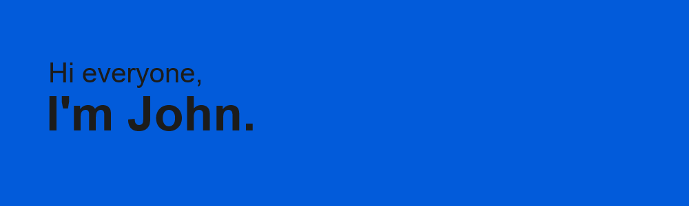

<!--
**LesCrow/LesCrow** is a ✨ _special_ ✨ repository because its `README.md` (this file) appears on your GitHub profile.
-->

 <h2>:man_technologist: About Me</h2>
<ul>
  <li> 
    💻 I'm a passionate <strong>React.js</strong> / <strong>Node.js</strong> developer 
  </li>
  <li> 
    📖 I’m  learning <strong>Next.js</strong> and <strong>TypeScript</strong>
  </li>
  <li> 
    🔭 I'm currently looking for a company for a one-year work-study contract 
    from March 2022 to March 2023   
  </li>
  <li> 
    🔥 Feel free to look at my work 
  </li>
</ul>
  
  
  <h2>🛠️ Languages and Tools</h2>
   
 
  
FrontEnd

  

      &nbsp;&nbsp;&nbsp;&nbsp;
      &nbsp;&nbsp;&nbsp;&nbsp;
      &nbsp;&nbsp;&nbsp;&nbsp;
  

    
  

  
BackEnd

  
  

      &nbsp;&nbsp;&nbsp;&nbsp;&nbsp;
    &nbsp;&nbsp;&nbsp;&nbsp;
      &nbsp;&nbsp;&nbsp;&nbsp;
  

      
           
  
   
Databases

  

    
   &nbsp;&nbsp;&nbsp;&nbsp;&nbsp;
      &nbsp;&nbsp;&nbsp;&nbsp;&nbsp;
  

  

   
  
  

<h2>:speech_balloon: How to reach me</h2>

<a href="mailto:john.baruteau@gmail.com" style="margin-bottom: 5px">:envelope: john.baruteau@gmail.com</a>
 

  
  

 

